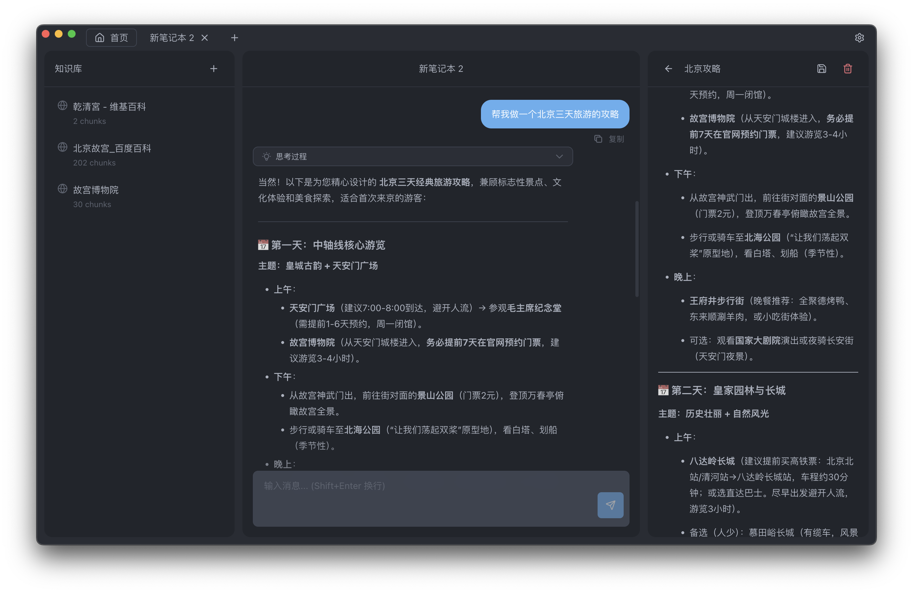

<div align="center">

# KnowNote

**一个以用户自有知识为中心的 AI 工作空间，帮助你思考、研究与写作。**

[](https://github.com/MrSibe/KnowNote/releases)
[](https://github.com/MrSibe/KnowNote/stargazers)
[](https://github.com/MrSibe/KnowNote/blob/main/LICENSE)
[](https://github.com/MrSibe/KnowNote/issues)

[简体中文](README.md) | [English](README_EN.md)

</div>

---

## 关于 KnowNote

KnowNote 是一个**本地优先**的知识笔记工具，灵感来自 Google NotebookLM。它将你的 PDF、Word 文档、PowerPoint 和网页转化为可提问、可引用、可追溯的个人知识库。

与其将文件当作静态资料存储，不如让 KnowNote 帮你构建一个结构化、可搜索、可对话的知识体系。通过结合文档解析、向量检索和检索增强生成（RAG）技术，KnowNote 帮助你理解、连接和重用信息——而不仅仅是存储它们。

### 核心优势

- 🔒 **本地优先** - 数据完全存储在本地，隐私安全有保障
- 🤖 **自定义 LLM** - 支持 OpenAI、DeepSeek等多种 AI 服务
- ⚡ **轻量快捷** - Electron 桌面应用，启动迅速，响应流畅

---

## 界面预览

<div align="center">
  
  <p><i>三栏布局：知识库管理 | AI 智能问答 | 笔记输出</i></p>
</div>

---

## 核心特性

### 📚 文档管理

- **多格式支持**：PDF、Word（.docx）、PowerPoint（.pptx）、网页链接
- **智能解析**：自动提取文档结构和关键内容
- **结构化存储**：使用 SQLite 本地数据库，快速可靠

### 🤖 AI 智能问答

- **RAG 技术**：基于检索增强生成，让 AI 回答更准确
- **多 LLM 支持**：OpenAI、DeepSeek、本地模型等自由选择
- **来源追溯**：每个答案都能追溯到原始文档的具体位置

### 🔒 本地优先

- **隐私保护**：所有数据存储在本地，完全掌控你的知识资产
- **离线可用**：核心功能无需联网（AI 对话需要配置 API）
- **数据安全**：无需担心数据泄露或被第三方访问

### 🔍 向量检索

- **语义搜索**：使用 sqlite-vec 进行高效的向量检索
- **智能匹配**：快速定位与问题最相关的文档内容
- **精准定位**：在海量知识中找到你需要的信息

### ⚡ 轻量快捷

- **桌面应用**：基于 Electron，原生体验
- **快速响应**：优化的性能，流畅的交互
- **跨平台**：支持 Windows、macOS

---

## 产品路线图

### ✅ 已完成

- **AI 大模型对话** - 集成多种主流 LLM 服务
- **笔记生成** - 智能生成结构化笔记
- **RAG 文档检索** - 基于向量的语义检索
- **多格式文档导入**
  - PDF 文档解析
  - Word 文档（.docx）
  - PowerPoint 演示文稿（.pptx）
  - 网页内容抓取

### 🚧 开发中

- **答题生成功能** - 根据文档自动生成测试题
- **PPT 自动生成** - 从笔记一键生成演示文稿
- **思维导图生成功能** - 根据对话一键生成思维导图

### 📋 计划中

更多功能正在规划中，欢迎在 [Issues](https://github.com/MrSibe/KnowNote/issues) 提出你的建议！

---

## 快速开始

### 用户下载安装

前往 [GitHub Releases](https://github.com/MrSibe/KnowNote/releases) 下载最新版本：

- **Windows**: `KnowNote-Setup-{version}.exe`
- **macOS**: `KnowNote-{version}.dmg` 或 `KnowNote-{version}-arm64.dmg`（Apple Silicon）

### 开发者快速启动

**前置要求**

- Node.js 18+
- pnpm（推荐）或 npm

**安装与运行**

```bash
# 克隆仓库
git clone https://github.com/MrSibe/KnowNote.git
cd KnowNote

# 安装依赖
pnpm install

# 启动开发服务器
pnpm dev
```

---

## 技术栈

KnowNote 采用现代化的技术栈构建，确保性能和可维护性：

| 技术             | 用途                 |
| ---------------- | -------------------- |
| **Electron**     | 跨平台桌面应用框架   |
| **React 19**     | 前端 UI 框架         |
| **TypeScript**   | 类型安全的开发体验   |
| **TailwindCSS**  | 原子化 CSS 框架      |
| **Vite**         | 快速的构建工具       |
| **SQLite**       | 轻量级本地数据库     |
| **sqlite-vec**   | 向量检索扩展         |
| **Drizzle ORM**  | 类型安全的数据库 ORM |
| **pdfjs-dist**   | PDF 文档解析         |
| **mammoth**      | Word 文档解析        |
| **officeparser** | Office 文档解析      |
| **Tiptap**       | 富文本编辑器         |

---

## 开发指南

<details>
<summary><b>📦 构建应用</b></summary>

```bash
# 构建 Windows 应用
pnpm build:win

# 构建 macOS 应用
pnpm build:mac

# 构建 Linux 应用
pnpm build:linux
```

构建产物将输出到 `dist/` 目录。

</details>

<details>
<summary><b>🗄️ 数据库管理</b></summary>

KnowNote 使用 Drizzle ORM 进行数据库管理：

```bash
# 生成迁移文件
pnpm db:generate

# 执行数据库迁移
pnpm db:migrate

# 直接推送 schema 变更（开发环境）
pnpm db:push

# 打开 Drizzle Studio（可视化数据库管理）
pnpm db:studio
```

</details>

<details>
<summary><b>🔧 代码质量</b></summary>

```bash
# 代码格式化
pnpm format

# 代码检查
pnpm lint

# 类型检查
pnpm typecheck
```

</details>

---

## 项目结构

```plaintext
KnowNote/
├── src/
│   ├── main/              # Electron 主进程
│   │   ├── db/            # 数据库配置和 schema
│   │   ├── services/      # 核心业务逻辑（文档解析、RAG 等）
│   │   └── providers/     # LLM 提供商管理
│   ├── renderer/          # React 渲染进程（前端界面）
│   ├── preload/           # Electron 预加载脚本
│   └── shared/            # 共享代码和类型定义
├── resources/             # 应用资源（图标等）
├── build/                 # 构建配置
└── out/                   # 编译输出
```

---

## 贡献指南

我们欢迎所有形式的贡献！无论是报告 bug、提出新功能建议，还是直接提交代码。

### 如何贡献

1. **报告问题**：在 [Issues](https://github.com/MrSibe/KnowNote/issues) 页面提交 bug 报告或功能建议
2. **提交代码**：
   - Fork 本仓库
   - 创建你的特性分支（`git checkout -b feature/AmazingFeature`）
   - 提交你的修改（`git commit -m 'Add some AmazingFeature'`）
   - 推送到分支（`git push origin feature/AmazingFeature`）
   - 开启一个 Pull Request

### 支持项目

如果你觉得 KnowNote 对你有帮助，请考虑：

- 给项目点个 ⭐ Star
- 分享给更多需要的人
- 在 [Issues](https://github.com/MrSibe/KnowNote/issues) 提供反馈和建议

---

## 许可证

本项目采用 [GPL-3.0 License](LICENSE) 开源协议。

---

## 致谢

感谢以下开源项目和技术：

- [Google NotebookLM](https://notebooklm.google/) - 灵感来源
- [Electron](https://www.electronjs.org/) - 跨平台桌面应用框架
- [React](https://react.dev/) - UI 框架
- [SQLite](https://www.sqlite.org/) & [sqlite-vec](https://github.com/asg017/sqlite-vec) - 数据存储与向量检索

---

## Star History

[](https://www.star-history.com/#MrSibe/KnowNote&type=timeline&legend=top-left)

<div align="center">
  <p>由 <a href="https://github.com/MrSibe">@MrSibe</a> 用心打造</p>
  <p>如果这个项目对你有帮助，请给它一个 ⭐ Star！</p>
</div>
